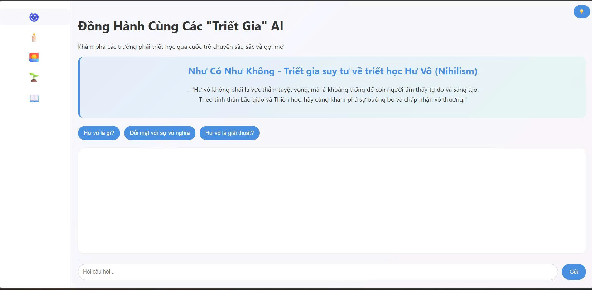

# Triết Học AI: Chatbot Đa Nhân Cách

Một ứng dụng chatbot được xây dựng để mô phỏng các cuộc trò chuyện với các "triết gia" AI, mỗi người đại diện cho một trường phái triết học lớn. Dự án sử dụng mô hình ngôn ngữ Google Gemini và kỹ thuật Retrieval-Augmented Generation (RAG) để cung cấp những câu trả lời sâu sắc dựa trên một kho kiến thức riêng.

## Demo Trực Quan

*Gợi ý: Quay lại màn hình bạn đang tương tác với chatbot ở các tab khác nhau.*

## Tính Năng Nổi Bật

- **Chatbot Đa Nhân Cách**: Trò chuyện với 5 "triết gia" AI từ các trường phái: Hư Vô, Bi Quan, Khắc Kỷ, Hiện Sinh, và Mác-Lênin.
- **Kiến Thức Chuyên Sâu**: Câu trả lời được tạo ra dựa trên một kho tài liệu triết học tùy chỉnh, giúp tăng độ chính xác và chiều sâu.
- **Giao Diện Trực Quan**: Giao diện web đơn giản, dễ sử dụng với các tab riêng biệt cho từng triết gia.
- **Gợi Ý Mồi**: Cung cấp các câu hỏi mẫu để người dùng dễ dàng bắt đầu cuộc trò chuyện.
- **Chế độ Tối/Sáng**: Tùy chỉnh giao diện để phù hợp với sở thích.

## Kiến Trúc và Công Nghệ

Dự án được xây dựng dựa trên kiến trúc RAG (Retrieval-Augmented Generation) hiện đại.

Các bước: User Input -> Embedding -> FAISS Search -> Retrieve Docs -> Prompt Engineering -> Gemini LLM -> Output.*

- **Mô hình ngôn ngữ (LLM)**: Google Gemini (`gemini-2.5-flash`).
- **Framework nền**: LangChain.
- **Backend**: Python, Flask.
- **Frontend**: HTML, CSS, JavaScript.
- **Cơ sở dữ liệu Vector**: `FAISS` của Meta.
- **Embedding Model**: `sentence-transformers/all-MiniLM-L6-v2`.
- **Triển khai**: Chạy trên Kaggle Notebook và public qua `ngrok`.

## Luồng Hoạt Động

1.  **Nạp Dữ Liệu**: Hệ thống đọc và xử lý các tài liệu triết học (`.pdf`, `.docx`) để xây dựng kho kiến thức.
2.  **Vector Hóa**: Toàn bộ kiến thức được chia nhỏ và mã hóa thành các vector, sau đó được lưu trữ trong FAISS.
3.  **Truy Vấn (Retrieval)**: Khi người dùng đặt câu hỏi, hệ thống tìm kiếm và truy xuất những thông tin liên quan nhất từ kho vector.
4.  **Tạo Sinh (Generation)**: Thông tin truy xuất được kết hợp với câu hỏi của người dùng và các chỉ thị về "nhân cách" để tạo thành một prompt hoàn chỉnh.
5.  **Phản Hồi**: Prompt này được gửi đến mô hình Gemini để tạo ra câu trả lời cuối cùng và hiển thị cho người dùng.

## Cài Đặt và Sử Dụng

Dự án này được thiết kế để chạy trong môi trường Kaggle Notebook.

1.  **Mở Notebook**: Tải file `chatbot-kaggle_final.ipynb` lên Kaggle và mở nó.
2.  **Cấu hình API Key**:
    -   Lấy API Key của bạn từ Google AI Studio.
    -   Trong cell thứ 2, thay thế `""` bằng API Key của bạn: `os.environ["GOOGLE_API_KEY"] = "YOUR_API_KEY_HERE"`
    -   Cấu hình token `ngrok` for fast deployment and tesing
3.  **Chạy Toàn Bộ**: Chọn "Run All" để thực thi tất cả các cell trong notebook (Nhớ điều chỉnh đường dẫn tới các file path khác nhau).
4.  **Truy Cập Ứng Dụng**: Sau khi cell cuối cùng chạy xong, một đường link `ngrok.io` sẽ xuất hiện. Nhấp vào đó để mở giao diện chatbot trong trình duyệt của bạn.

## Các Triết Gia AI

-   🌀 **Như Có Như Không (Hư Vô)**: Suy tư về sự buông bỏ và tự do trong vô thường.
-   🕯️ **Buồn Thì Cứ Khóc (Bi Quan)**: Nhìn thẳng vào khổ đau để sống tỉnh thức.
-   🌅 **Tâm Lặng Như Nước (Khắc Kỷ)**: Rèn luyện sự bình thản và làm chủ cảm xúc.
-   🌱 **Một Đời Trọn Vẹn (Hiện Sinh)**: Khám phá tự do, trách nhiệm và ý nghĩa tự tạo.
-   📖 **Đồng Cam Cộng Hưởng (Mác-Lênin)**: Phân tích xã hội và vai trò của con người trong tập thể.
